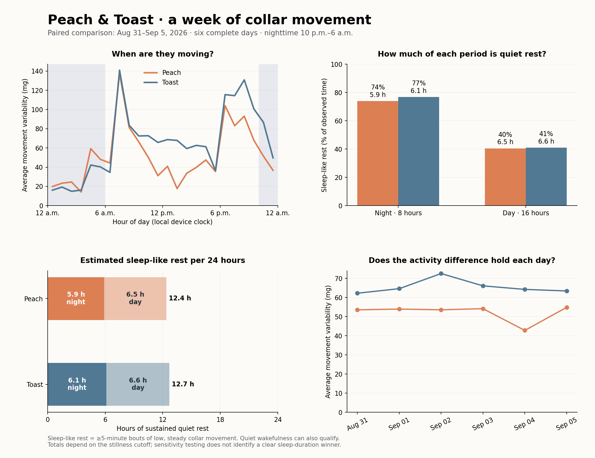

# Peach and Toast: activity and sleep-like rest

Toast recorded **26% more average collar movement** than Peach across six complete, matched calendar days, August 31–September 5, 2026. The difference was concentrated in daytime: **32% more**, compared with **3% more at night**. Their nighttime movement was therefore similar on average.

Both cats spent a much larger fraction of the night in sustained quiet rest. They accumulated slightly more total rest during daytime because daytime is twice as long. This is an estimate of **sleep-like rest**, which includes some quiet wakefulness; these recordings do not establish actual sleep duration.

| Average measure | Peach | Toast |
|---|---:|---:|
| Collar movement variability, all hours | 52.1 mg | 65.5 mg |
| Time with movement above 20 mg per 24 h | 6.5 h | 7.9 h |
| Sleep-like rest, night (10 p.m.–6 a.m.; 8 h) | 5.9 h (74%) | 6.1 h (77%) |
| Sleep-like rest, day (6 a.m.–10 p.m.; 16 h) | 6.5 h (40%) | 6.6 h (41%) |
| Sleep-like rest, total per 24 h | 12.4 h | 12.7 h |

Time above the movement threshold is accumulated from five-second intervals and is not continuous walking, exercise time, or wake time. Movement and sleep-like rest do not add to 24 hours: shorter quiet periods fall into neither category.

**Behavioral observations**

- Toast was more active on **all six days**; the daily difference ranged from 16% to 50%.
- Both cats had their largest average morning activity peak around **7–8 a.m.**, with another busy period around **6–10 p.m.** The data alone cannot attribute those peaks to meals, play, or other causes.
- **Midnight–4 a.m. was especially quiet** for both. Activity picked up around 4–6 a.m., before the main morning peak.
- Peach had a pronounced midday lull; Toast retained more movement during midday and the later evening.
- **There is no reliable sleep-duration winner.** The small difference between the cats changes direction when the stillness threshold changes.

**How much do the sleep estimates depend on the method?**

The quiet-movement distributions for both collars peak near 8–12 mg. A common 20 mg cutoff was chosen above that peak, then compared with 15, 30, and 40 mg. A 10 mg cutoff cuts through the quiet-movement peak and fragments sustained rest, producing much lower totals; it is unsuitable as the main cutoff here. The cutoff is an operational choice, not a clinically validated feline sleep boundary.

| RMS cutoff; minimum bout 5 min | Peach rest / 24 h | Toast rest / 24 h |
|---|---:|---:|
| 15 mg | 12.14 h | 12.39 h |
| 20 mg | 12.37 h | 12.69 h |
| 30 mg | 13.05 h | 12.87 h |
| 40 mg | 13.33 h | 13.03 h |

Across these four cutoffs and minimum bouts of five or ten minutes, Peach's estimates span **12.0–13.3 h/day** and Toast's **12.2–13.0 h/day**. These are sensitivity ranges, not confidence intervals or bounds on actual sleep. Both retain substantially higher nighttime rest fractions throughout this range. The threshold-free activity-intensity comparison does not depend on these sleep cutoffs.

**Data coverage and method**

- Sources: `CWA-DATA peach.CWA` and `CWA-DATA toast.CWA`. Collar annotations match their filenames. You confirmed continuous wear.
- Both use nominal 25 Hz, ±8 g, three-axis recording. All packet checksums pass. Peach has 15,176,520 samples; Toast has 15,033,000 samples.
- Peach spans August 30 at 14:10:49 to September 6 at 14:10:01. Toast spans August 30 at 13:40:13 to September 6 at 13:38:05. First and last partial calendar days are excluded from the main comparison.
- Toast has one 76.98-second recording interruption on August 31, approximately 16:37:51–16:39:08. Peach has no acquisition gaps. Five-second bins overlapping the gap are excluded from **both** cats, leaving 143 h 58 min 40 s of matched observations (99.985% coverage). Nighttime coverage is 48 h; daytime coverage is 95 h 58 min 40 s.
- Hours are the devices' local wall-clock times, assumed Pacific; the files do not independently establish their timezone or synchronization to an external clock. Nighttime means 22:00–06:00. Each calendar day's night statistic combines 00:00–06:00 and 22:00–24:00.
- Fractional timestamp offsets are corrected, and times are interpolated between valid packet anchors within continuous acquisition segments. Measured median rates are about 25.084 Hz for Peach and 24.855 Hz for Toast. Missing time is preserved. The timing correction follows the [Open Movement reference reader](https://github.com/openmovementproject/openmovement-python/blob/master/src/openmovement/load/cwa_load.py).
- Movement intensity is the mean of five-second vector RMS values: `1000 × sqrt(var(x) + var(y) + var(z))`, with population variances and acceleration measured in g. Subtracting each interval's mean vector reduces dependence on static gravity offsets and fixed collar orientation. Posture changes and collar/head movement still contribute; this is not a measure of distance, steps, or energy use. No full laboratory gain calibration was available.
- Sleep-like rest requires RMS below 20 mg and less than 5° change between consecutive five-second mean acceleration vectors. Bouts must span at least five minutes with at least 90% qualifying quiet intervals. Only internal interruptions up to 30 seconds can connect a bout; those interruptions earn no rest time. Invalid data never bridge a bout. At least 4.9 seconds of sample coverage are required per five-second interval.
- Period hours equal the observed rest fraction multiplied by 8, 16, or 24. This corrects the tiny missing-data imbalance. Day and night estimates therefore compare rates as well as totals.
- Quiet wakefulness may qualify as rest; movement during real sleep may fail the rule. No labeled sleep observations were supplied. Published [feline accelerometer validation research](https://pubmed.ncbi.nlm.nih.gov/37631701/) uses synchronized video to train and assess behavior classification; this report does not apply a validated feline sleep classifier.
- The earlier Toast viewer and exports in the project cover a shorter recording snapshot and use a different heuristic. This comparison is freshly computed from both complete CWA files. The older artifacts are left in place.

**Daily activity check**

| Date | Peach mean RMS | Toast mean RMS | Toast relative to Peach |
|---|---:|---:|---:|
| 2026-08-31 | 53.6 mg | 62.2 mg | +16.2% |
| 2026-09-01 | 54.0 mg | 64.6 mg | +19.8% |
| 2026-09-02 | 53.6 mg | 72.5 mg | +35.4% |
| 2026-09-03 | 54.2 mg | 66.1 mg | +22.1% |
| 2026-09-04 | 42.8 mg | 64.3 mg | +50.2% |
| 2026-09-05 | 54.9 mg | 63.4 mg | +15.6% |

**Files and reproduction**

[Charts](comparison.png) · [Full summary and sensitivity data](comparison.json) · [Analysis script](../cattrack/compare.py)

From the project folder, run `.venv/bin/python -m cattrack.compare`. The script reads both raw files and regenerates the summary, charts, report, and five-second epoch caches. Add `--reuse-epochs` only when the raw files and extraction code have not changed. Tests: `.venv/bin/python -m unittest discover -s tests -v`.
